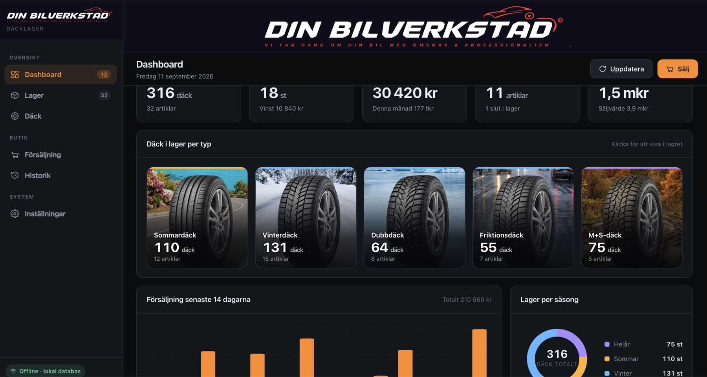
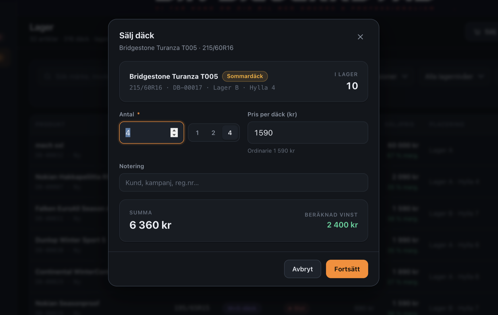
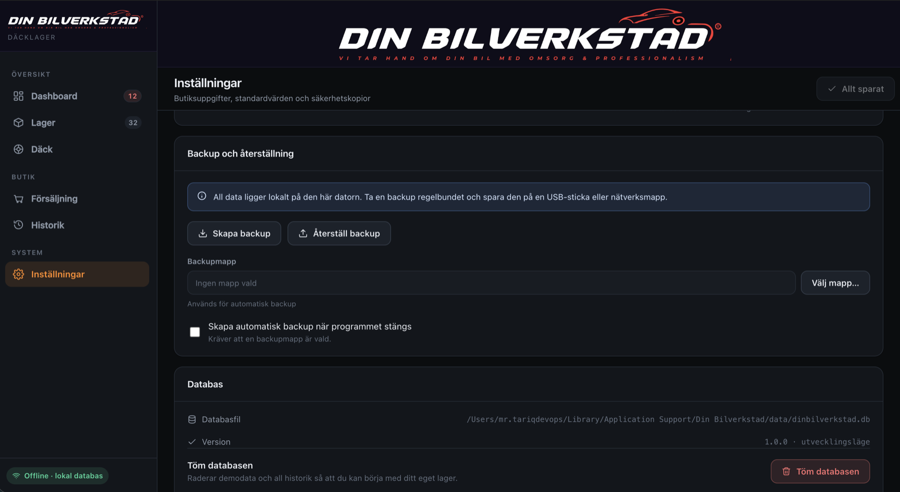

# Din Bilverkstad — Tire Inventory & Point-of-Sale System

A complete offline desktop application for a Swedish car workshop, built to manage
tire stock, sales and reporting. Ships as a single Windows installer
(`TireShop-Setup.exe`) — no server, no cloud account, no internet connection, no
subscription. All data lives in a local SQLite database on the workshop's own PC.



<table>
<tr>
<td width="50%"></td>
<td width="50%"></td>
</tr>
<tr>
<td align="center"><em>Sale flow — live total &amp; profit, stock guard</em></td>
<td align="center"><em>Backup, restore and database management</em></td>
</tr>
</table>

---

## The problem

Small independent tire workshops in Sweden run their stock on paper or in a
spreadsheet. That breaks down fast: nobody knows how many 205/55R16 winter tires
are actually on the shelf, studded tires get logged as summer tires, and there is
no reliable record of what was sold or what it earned.

The off-the-shelf alternatives are cloud SaaS products — monthly fees per seat,
a mandatory login, and a hard dependency on the workshop's internet connection.
A garage with a single back-office PC and patchy Wi-Fi does not want that.

## The goal

Build a **single-purpose desktop program** that a non-technical member of staff
can install and use on day one:

- **Fully offline.** Zero network calls. It works with the network cable unplugged.
- **Zero infrastructure.** No server, no database to administer, no login.
- **Install like any Windows program.** Double-click an `.exe`, next-next-finish.
  No Node.js, npm, Git, Docker or Python on the customer's machine.
- **Fast data entry.** Registering a rack of tires is the most repeated task in
  the shop, so it is built around the keyboard, not the mouse.
- **Data integrity that survives real use.** Stock can never go negative, a sale
  can never oversell, and a mistake is always reversible.
- **Localised.** The entire interface, installer and error messages are in Swedish.

---

## What it does

| Module | Capability |
|---|---|
| **Dashboard** | Live KPIs — units in stock, sold today, revenue today, low-stock alerts, total stock value and retail value. Stock split across the five tire categories (click a category to jump into a filtered inventory view), a 14-day sales bar chart, a season-distribution donut, a low-stock list and a best-sellers list. |
| **Inventory** | Searchable, sortable table with combined filters on tire type, brand, dimension, stock level and new/used. Inline edit, sell and delete. |
| **Tire registration** | Rapid-entry form built for logging many tires in a row. Category is chosen with a single click; <kbd>Ctrl</kbd>+<kbd>Enter</kbd> saves and immediately opens the next blank form while keeping brand, season and location. Dimensions are normalised automatically — typing `2055516` becomes `205/55R16`. |
| **Sales** | Find the tire, set quantity and price, review a live total and calculated profit, then confirm. Stock is decremented inside the same transaction and overselling is impossible. |
| **History** | Every sale with date filters (today, 7/30 days, this year, custom range), running totals, and the ability to reverse a sale — which returns the tires to stock. |
| **Settings** | Shop name, logo, currency, defaults for new items, backup configuration and database management. |

### Domain modelling

The five tire categories are the core domain decision. A passenger-car workshop
deals with exactly these, so the system models them explicitly rather than
offering free-text fields:

| Category | Season | Studded |
|---|---|---|
| Sommardäck (Summer) | Summer | No |
| Vinterdäck (Winter) | Winter | No |
| Dubbdäck (Studded) | Winter | **Yes** |
| Friktionsdäck (Friction) | Winter | No |
| M+S-däck | All-year | No |

Staff pick **one** category; season and studded status are derived from it. This
makes an entire class of data-entry error structurally impossible — a studded
tire can never be filed as a summer tire. The winter filter correctly spans
studded and friction tires, because both *are* winter tires. Adding a sixth
category is a one-line change to `TIRE_CATEGORIES` in
[`shared/constants.ts`](shared/constants.ts); forms, filters and the dashboard
pick it up automatically.

---

## Tech stack

| Layer | Technology | Why |
|---|---|---|
| **Desktop shell** | Electron 44 | Native Windows window, menus, file dialogs and lifecycle from one codebase. |
| **UI** | React 18.3 + TypeScript 5.6 (strict) | Component model for a data-dense interface; strict typing across the IPC boundary. |
| **Build** | Vite 8.3 + `vite-plugin-electron` | Sub-second HMR while developing the desktop UI; ESM bundling for both processes. |
| **Database** | SQLite via `sql.js` 1.12 (WebAssembly) | Real SQLite files and real SQL with **no native module to compile**. |
| **Packaging** | electron-builder 26 → NSIS | Produces a signed-ready `TireShop-Setup.exe` for Windows x64. |
| **Testing** | Vitest 5 + `@vitest/coverage-v8` | Fast unit and integration tests against a real SQLite database. |
| **Styling** | Hand-written CSS with design tokens | No UI framework — a token-based design system (`src/styles/tokens.css`) keeps a consistent dark theme. |
| **Charts** | Custom SVG components | Bar and donut charts written from scratch; no charting dependency. |

**Deliberately not used:** no state-management library, no UI kit, no ORM, no
charting library, no HTTP client. Every dependency in `package.json` is a
*devDependency* — the packaged application ships **no runtime `node_modules` at
all**, only bundled JavaScript plus the SQLite WebAssembly binary.

### Why WebAssembly SQLite instead of a native module

`better-sqlite3` and friends are native addons: they must be compiled per
platform and per Electron ABI. That would mean a Windows build machine, a
rebuild step on every Electron upgrade, and a real chance of the customer hitting
a missing Visual C++ runtime.

`sql.js` is official SQLite compiled to WebAssembly. The trade-off is that the
database is held in memory and flushed to disk, rather than paged — entirely
acceptable for a single workshop's inventory. What it buys:

- The **Windows installer is built from a Mac**, with no cross-compilation.
- The customer never needs build tools.
- Upgrading Electron can never break the database layer.

Writes go to disk **atomically** — written to a temporary file then `rename`d —
after every transaction, so a power cut cannot leave a half-written database.

---

## Architecture

The application is split across Electron's two processes, with a narrow, typed
bridge between them:

```
┌─ Renderer process (sandboxed) ──────────────┐
│  React 18 + TypeScript                      │
│  pages/ features/ components/ hooks/        │
│  No Node.js · No filesystem · No database   │
└──────────────────┬──────────────────────────┘
                   │  contextBridge — typed, explicit surface only
┌──────────────────┴──────────────────────────┐
│  Main process                               │
│  ipc/            uniform error handling     │
│  repositories/   business logic             │
│  services/       backup & restore           │
│  db/             SQLite engine, migrations  │
└──────────────────┬──────────────────────────┘
                   │
              SQLite file in %APPDATA%
```

```
electron/            Main process — everything touching the DB or the OS
  main.ts            Window, menu, lifecycle, single-instance lock
  preload.ts         Secure IPC bridge (contextBridge)
  db/                SQLite engine, migrations, demo seed data
  repositories/      Business logic: products, sales, statistics, settings
  services/          Backup and restore
  ipc/               IPC handlers with uniform error handling
shared/              Types, constants and demo data shared by both processes
src/                 React renderer
  components/        Reusable UI, layout and charts
  features/          Feature areas: inventory, tires, sales
  pages/             One file per sidebar view
  services/          API layer over the preload bridge
  hooks/ utils/      Shared hooks and helpers
  styles/ assets/    Design system and images
```

### Security model

The renderer runs with `contextIsolation: true`, `sandbox: true` and
`nodeIntegration: false`. React has **no** access to Node.js, the filesystem or
the database — only the functions explicitly exposed in
[`electron/preload.ts`](electron/preload.ts). Everything else follows from that:

- All SQL runs in the main process using **parameterised queries** — no string
  concatenation, so SQL injection has no surface.
- Every write runs inside a **transaction**.
- IPC handlers never throw across the bridge. Each returns a typed
  `ApiResult<T>`, so the UI always gets a predictable response and can render a
  readable Swedish error message instead of crashing.
- External links open in the system browser via a `setWindowOpenHandler` deny
  policy — the app window can never be navigated away from the application.
- A **single-instance lock** prevents two windows writing to the same database file.

### Data integrity

The rules that protect the workshop's data are enforced in the repository layer
and covered by tests:

- Stock can never go negative.
- A sale can never exceed available quantity.
- Reversing a sale returns exactly the sold quantity to stock.
- Quantity must be a positive integer; price can never be negative.
- Sales retain a snapshot of brand, model, size and purchase price, so history
  stays accurate and profit stays correct even if the product is later edited or
  deleted.

### Schema migrations

The schema is versioned in [`electron/db/migrations.ts`](electron/db/migrations.ts)
and migrations run automatically in order at startup, tracked in a
`schema_migrations` table. New migrations are always appended — never edited in
place — so a machine that already ran one is never affected. The second migration
in the project backfills legacy stock into the current tire-category model, and
that upgrade path is covered by tests.

---

## Testing & quality

```
Test Files  5 passed (5)
     Tests  119 passed (119)
  Duration  394ms
```

| Metric | Coverage |
|---|---|
| Statements | 84.8% |
| Lines | 86.7% |
| Functions | 87.9% |
| Branches | 74.3% |

119 tests cover the main-process business logic and the renderer's helpers —
that stock can never go negative, that overselling is rejected, that a reversed
sale restores stock, that dashboard KPIs compute correctly, that the tire
category drives season and studding, that legacy stock migrates correctly, that
a freshly created database is empty, and that backup and restore never destroy
existing data.

Tests run against a **real SQLite database** in a temporary directory — not a
mock — while Electron itself is replaced by a stub
([`tests/electronStub.ts`](tests/electronStub.ts)), so no window ever opens. The
whole suite finishes in under half a second.

TypeScript runs in `strict` mode with `noUnusedLocals`, `noUnusedParameters` and
`noFallthroughCasesInSwitch` enabled, and `npm run build` fails on any type error.

---

## Build & run

```bash
npm install
npm run dev          # Desktop window with hot reload
```

### Producing the Windows installer

```bash
npm run dist         # → release/TireShop-Setup.exe  (~114 MB, x64)
```

The NSIS installer offers a Swedish or English install flow, lets the user choose
the install directory, and creates desktop and Start Menu shortcuts. It is built
**from macOS** — no Windows machine and no native compilation involved.

| Command | Purpose |
|---|---|
| `npm run dev` | Development mode with hot reload |
| `npm run build` | Type-check, then build renderer and main process |
| `npm run dist` | Build the Windows installer `TireShop-Setup.exe` |
| `npm run dist:mac` | Build an unsigned macOS `.dmg` for testing |
| `npm run typecheck` | Type-check without building |
| `npm test` | Run the test suite |
| `npm run test:coverage` | Run tests with a coverage report |

### Where the data lives

The database is stored in the OS application-data directory — **never** in the
install folder — so it survives both upgrades and reinstallation.

| OS | Path |
|---|---|
| Windows | `%APPDATA%\Din Bilverkstad\data\dinbilverkstad.db` |
| macOS | `~/Library/Application Support/Din Bilverkstad/data/dinbilverkstad.db` |

**Backup** exports the database to any location — USB stick, network share, cloud
folder. **Restore** is a two-step operation: the file is validated first and the
app reports how many products and sales it contains, and only after explicit
confirmation is it written. A safety copy of the current database is always taken
first into `safety-backups/` (the ten most recent are kept). Automatic backup on
application exit can be enabled against a chosen folder.

---

## Engineering notes

A few decisions I'd call out:

- **The domain model does the validation.** Rather than validating that a studded
  tire has `season = winter`, the category *derives* both fields. Invalid states
  are unrepresentable instead of rejected.
- **Errors cross the IPC boundary as values, not exceptions.** A uniform
  `ApiResult<T>` wrapper means the UI has exactly one error path to handle.
- **Destructive actions are two-step and reversible.** Restore previews before
  writing and snapshots first; clearing the database requires confirmation;
  sales can be reversed.
- **Offline is verified, not assumed.** The application makes no network calls at
  all — it was tested by disconnecting the machine entirely and exercising every
  feature.
- **68 source files, ~9,200 lines** of TypeScript, TSX and CSS, organised by
  feature rather than by file type, with files kept small and focused.

## Possible next steps

- Label printing for shelf and rack tags
- CSV/Excel export of inventory and sales history
- Multi-user support over a LAN share (currently single-machine by design)
- Supplier orders and purchase-order tracking

---

## Documentation

The full end-user and developer manual, in Swedish, is in
**[docs/MANUAL.sv.md](docs/MANUAL.sv.md)**.

## Author

**Tariq** — [@Tariq555](https://github.com/Tariq555)

Designed, architected and built end to end: domain modelling, database schema and
migrations, Electron main-process services, IPC security layer, React interface,
custom design system and SVG charts, test suite, and Windows packaging.

---

© 2026 — All rights reserved. Published here as a portfolio reference.
